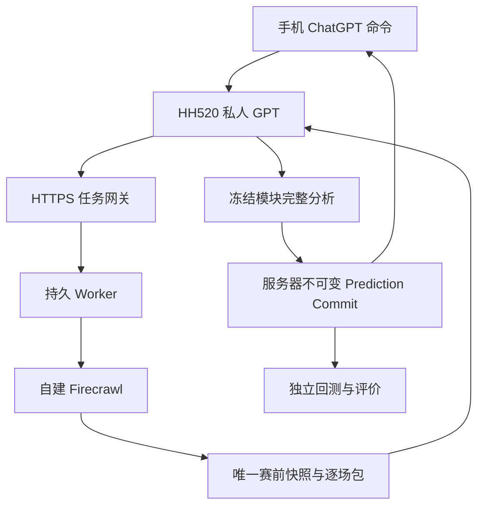

# HH520 Football AI System

工程版本 0.4.22。私人 GPT、HTTPS 任务网关、自建 Firecrawl、全量紧凑 GPT 交接、不可变 Prediction Commit 与独立回测服务已接通。每条新的预测或回测命令都创建新任务，从重新采集开始完整执行；旧记录不复用、不阻止新命令。T-30 模块已取消；其余 HH520 V2.1-Test 分析逻辑不变，Upgrade Package 1 保持 PARKED。

当前已验证：持久任务、真实整日采集、ChatGPT Actions、Bearer 认证、完整预测提交，以及回测重新采集、赛果屏蔽、重新预测、评价与改进报告。

## 使用入口

私人 GPT：<https://chatgpt.com/g/g-6a9b59f4ba4c8191ae091b40ae095160-hh520-football-ai>

可用命令：

- `检查连接`
- `采集 YYYY-MM-DD 所有比赛`
- `预测 YYYY-MM-DD 所有比赛`
- `回测 YYYY-MM-DD 所有比赛`
- `回测 YYYY-MM-DD至YYYY-MM-DD`（最多 7 天）

每条新命令都必须重新采集并完整执行，不能读取旧任务快照、旧 Prediction Commit 或旧报告代替本次运行。同一网络请求重试必须复用 request_id；下一条用户命令必须生成新的 request_id。

## 验证

```text
python scripts/verify_assets.py
python scripts/verify_assets.py --require-ready
python -m unittest discover -s tests -v
```

`--require-ready` 当前应返回成功。它证明资产和运行接线完整，不代表某一天的预测已经完成。

## 架构



GitHub 保存模型资产、Prompt、工程代码和版本；服务器保存任务、采集快照和运行时 Prediction Commit。模型核心、权重、公式和参数没有因工程化而修改。

## 仓库地图

|目录|用途|
|---|---|
|models/HH520_V2.1-Test|冻结模型说明、流程、指标、模块与状态清单|
|prompts / rules / calibration|原始 Prompt、规则和校准入口|
|config / workflows|运行配置与最终冻结执行顺序|
|task_manager|持久任务、恢复、取消、GPT 交接与归档 API|
|data_engine|Firecrawl 新鲜采集、身份绑定、最新快照筛选和有界 GPT 输入|
|prediction|Prediction Commit、记录契约和报告模板|
|backtest / evaluation|重新采集、脱敏重放与评价契约|
|versions|资产锁与版本指针|
|docs|Phase 1–6、来源、部署、验收和剩余缺口|

接管顺序：先读 [项目记忆](PROJECT_MEMORY.md)、[唤醒文件](WAKE_CODE.md)、[实际状态](docs/STATUS.md)，再读 [部署](docs/DEPLOYMENT.md) 和 [缺口](docs/GAPS.md)。
