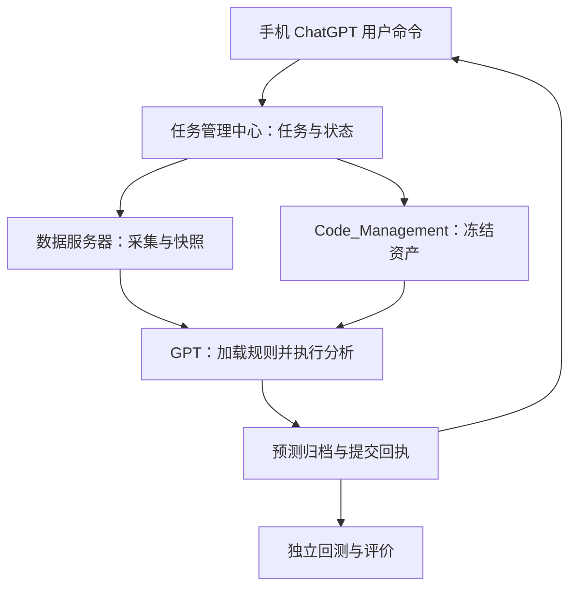

# HH520 Football AI System

0.3.0：加入既有 Firecrawl 程序的持久采集任务、逐场身份关联、采集回执和取消恢复。使用 `采集 YYYY-MM-DD 所有比赛`；详见 [采集说明](docs/COLLECTION.md)。真实预测与手机原对话自动回传仍未完成。

本仓库保存 HH520 V2.1-Test 模型资产与 Phase 1–6 工程架构。GPT 是预测执行者，任务管理中心负责持续调度，数据服务器负责采集事实，GitHub 保存模型、Prompt、流程和版本。

**当前交付：可校验的模型资料、项目接管文件、六阶段架构与接口契约。自动采集、GPT 持续执行、手机一句话预测尚未接通。** HH520 V2.1-Test 核心冻结，Upgrade Package 1 = PARKED。

## 从这里开始

先读 [项目记忆](PROJECT_MEMORY.md)、[唤醒文件](WAKE_CODE.md)、[真实状态](docs/STATUS.md)，再查看 [模型说明](models/HH520_V2.1-Test/模型说明.md) 和 [来源差异](docs/DECISIONS.md)。

本仓库以 Markdown 和 JSON 为主，使用 Python 3.10+ 标准库校验，不需要第三方依赖。以下命令从仓库根目录运行：

```text
python scripts/verify_assets.py
python scripts/wake.py
python scripts/verify_assets.py --require-ready
```

前两条只检查资产和读取接管摘要。第三条检查自动运行条件；当前会返回非零退出码并列出实际阻塞。校验 PASS 不等于预测已完成。脚本不会调用外部服务或重写模型。

## 总体架构



该图是目标架构，不表示服务已经部署。仓库中的校验工作流仅核验资产，不运行模型推理。

## 仓库地图

|目录|用途|
|---|---|
|models/HH520_V2.1-Test|模型说明、流程、指标、模块、校准、输出与锁定声明|
|prompts / rules / calibration|原始 Prompt 与规则、校准单一入口|
|config / workflows|工程配置及流程参考；运行开关默认关闭|
|task_manager|任务契约、生命周期、恢复与重试方案|
|data_engine|数据接口、快照契约、来源与一致性要求|
|prediction|GPT 交接接口、Prediction Commit 与报告模板|
|backtest / evaluation|Prediction Archive First、结果比较与指标定义|
|versions|stable/development/test/archive 指针和 SHA-256 锁|
|logs|执行日志契约，不保存密钥|
|docs|Phase 1–6、来源、差异、缺口、验收与运维|
|scripts|资产校验与本地唤醒摘要|

## 模型与预测流程

最终架构主链为：重要注意事项 → Prompt → 数据审计 → Water Market → Correct Score → SoccerSTATS HT/FT → 球队/联赛/公司 → Cross Model → Calibration → Prediction Commit → 输出。

S03 运行增强的 DCS、赔率异常、风险、冲突检测和执行日志均已保留。旧完整 SOP 与最终架构对模块顺序有差异，见 [决策记录](docs/DECISIONS.md)。本次未重排模型内核，也未新增权重或 Calibration 算法。

实时预测必须获取本次唯一新快照，绑定模型、Prompt、数据 Hash。数据字段异常按原规则隔离并记录；模型资产或 Prompt 不完整时不得启动自动预测。结果先保存提交证据，再按 **精准比分 → 半全场 → 其他市场** 展示，同时提供各模块可核验依据和异常说明。

## 回测流程

先加载运行规则和对应 Prompt，再检查预测档案。已有有效预测：读取原预测、原数据与日志并对比真实赛果，不重新预测。确认没有档案：重新采集当时可用数据，完整预测并归档后再比较。档案访问失败必须报错，不能冒充“没有预测”。

赛后结果与预测输入隔离；不覆盖原预测、不按赛果调参。独立 Backtest Mode Prompt 仍待补齐，当前只有契约与流程设计。

## 版本与升级

当前 stable 指向 HH520 V2.1-Test。工程资产包版本 0.1.0 与模型版本分开。开发、测试和历史归档只记录指针，不复制稳定模型造成多份正文漂移。任何模型升级另开版本并按既有 100+ 场样本、统计、提案、人工批准流程处理。此次不启动 Upgrade Package 1。

## 恢复与新账号接管

新账号需能读取此仓库或上传项目包；唤醒码是上下文入口，不是账户凭据，也不会自动继承权限。使用 [WAKE_CODE.md](WAKE_CODE.md) 中的完整接管文本。

恢复先核验资产锁与来源，再读状态和缺口。未来任务中断时必须使用原任务绑定的快照与资产版本；外部提交回执不明时先查询归档，禁止重复生成另一份预测冒充恢复。具体方法见 [运维](docs/OPERATIONS.md)。

## 验收与下一步

见 [六阶段路线](docs/ROADMAP.md) 与 [验收](docs/ACCEPTANCE.md)。优先核对旧模型的数值规则和流程差异，再接入任务执行器、数据服务器及 GPT 执行接口，最后联调回测。没有部署证据、数据快照和端到端记录，不把架构文件视为运行系统完成。

## 已保存冻结基线

另从旧仓库取回 [2026-09-02 冻结基线补充](models/HH520_V2.1-Test/冻结基线补充.md)：Firecrawl 必须先行、历史 T-30、页面去重、八个独立市场、DNA 和 S/A/B/C/PASS。原始 blob 与来源提交都已保存。版本栈与后期会话存在差异，接入前必须核对。

## 工程版本 0.2.0：命令入口已实现

新增持久任务服务、后台启动检查、去重、恢复、取消、报告查询、Actions 契约及部署草案。使用与实际边界见 [手机命令接入](docs/MOBILE_GATEWAY.md)。连接检查可运行，真实预测仍阻塞；尚未部署服务器或完成手机原会话自动返回。

服务器部署现已完成：[部署验收](docs/DEPLOYMENT.md)。HTTPS、认证、后台连接检查和重启持久化均通过；账户侧 Actions 与真实预测尚未接通。
